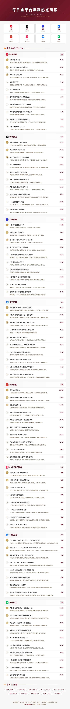

# 每日全平台爆款热点简报 🦊

>  Skill — 每天上午 10:00 自动抓取 8 大平台热搜，生成高级感风格 PNG 长图。

## 效果预览



## 覆盖平台

| 平台 | 数据源 | 类型 |
|------|--------|------|
| 🔴 微博 | tophub.today | 实时热搜 |
| 🎵 抖音 | abangshou.com | 实时热点 |
| 🔵 百度 | xpaihang.com | 实时热搜 |
| 💡 知乎 | tophub.today | 实时热榜 |
| 📰 头条 | abangshou.com | 实时热榜 |
| 📕 小红书 | 趋势数据 | 热门话题 |
| 💻 36氪 | xpaihang.com | 科技热榜 |
| 💬 微信 | 搜狗热搜 | 热文榜 |

## 功能特性

- **自动化定时**：配合 WorkBuddy Automation 每日上午 10 点执行
- **品牌定制**：野新派深酒红(#7A1A2B) + 金色(#C8A45C) 配色
- **SVG 平台图标**：8 个平台均使用内联 SVG 图标，无需外部资源
- **热点总结**：每条热搜附带 1-2 句概要，快速理解话题背景
- **PNG 长图输出**：750px 宽手机竖屏长图，直接转发给学员

## 安装使用

### 1. 安装为 WorkBuddy Skill

```bash
# 复制 SKILL.md 到 skills 目录
cp SKILL.md ~/.workbuddy/skills/daily-hotspot-briefing/
```

### 2. 环境依赖

```bash
# 安装 Playwright
npm install -g playwright
npx playwright install chromium

# 系统 Node.js >= 18
```

### 3. 创建自动化任务

在 WorkBuddy 中设置每天上午 10:00 执行：

```
调度: FREQ=DAILY;BYHOUR=10;BYMINUTE=0
```

## 设计规范

- 页面背景: `#faf8f6` 浅米色
- 卡片: 白色 + 细边框
- 主色: 深酒红 `#7A1A2B`
- 点缀: 金色 `#C8A45C`
- 宽度: 750px（手机 Retina 2x）
- 字体: PingFang SC / system-ui

## 技术栈

- HTML + CSS（纯内联，零依赖）
- Playwright（HTML → PNG 截图）
- WorkBuddy Automation（定时触发）

## License

MIT
